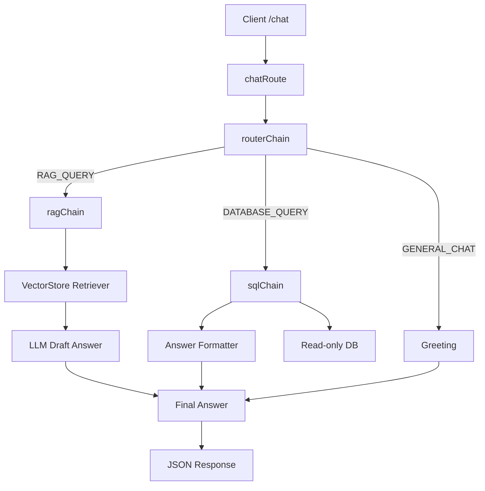

# Project Flow & Ops Guide

## Quick Start
- Install deps: `npm install`
- Env: copy `.env` and set `OPENAI_API_KEY`, `OPENAI_MODEL`, DB creds, and RAG limits (see [src/config/env.js](src/config/env.js)).
- Run dev server: `npm run dev` (port from `PORT`, default 4000).
- API to test: POST `/chat` with JSON `{ "question": "...", "sessionId": "optional" }`. Streaming currently disabled in route.

## High-Level Flow
1) **/chat** → [src/api/chatRoute.js](src/api/chatRoute.js): validates payload, calls router (stream off).
2) **Router** → [src/rag/routerChain.js](src/rag/routerChain.js):
   - Intent via LLM zero-temp classifier → DATABASE_QUERY | RAG_QUERY | GENERAL_CHAT.
   - DATABASE_QUERY → SQL chain.
   - RAG_QUERY → RAG chain.
   - GENERAL_CHAT → canned greeting.
3) **RAG chain** → [src/rag/ragChain.js](src/rag/ragChain.js):
   - Uses FAISS retriever from vectorStore.
   - Builds context prompt; LLM (temp 0) drafts answer.
   - Returns `{ answer, source: "rag" }`.
4) **SQL chain** → [src/rag/sqlChain.js](src/rag/sqlChain.js):
   - Generates SELECT-only SQL with schema/joins hints, partial name matching, leave categories, roles/permissions JSON guidance.
   - Safety: SELECT-only, allowed tables, auto LIMIT 50 (unless count), markdown strip, logging, 3s timeout.
   - Executes via read-only pool [src/db/query.js](src/db/query.js); on DB error returns friendly fallback.
   - Formats rows into user-friendly answer (no fabrication of categories).
5) **Vector store init** → [src/rag/vectorStore.js](src/rag/vectorStore.js):
   - Loads unstructured docs via [src/rag/loaders/fileLoader.js](src/rag/loaders/fileLoader.js) and structured docs via [src/rag/loaders/structuredLoader.js](src/rag/loaders/structuredLoader.js), splits, embeds (OpenAIEmbeddings), builds FAISS.

## Data Sources
- Unstructured: `data/unstructured/*.txt|md|pdf` → chunked and embedded.
- Structured for RAG context: MySQL rows via structured loader.
- Live SQL answers: SQL chain (allowed tables include employees, attendances, employee_leaves, leave_types, roles/permissions, etc.).

## Intent & Routing
- Classifier: [src/rag/intentChain.js](src/rag/intentChain.js) returns one of DATABASE_QUERY, RAG_QUERY, GENERAL_CHAT (temp 0, single-word output).
- Router: [src/rag/routerChain.js](src/rag/routerChain.js) switches cleanly; no OpenAI or DB logic inside.

## Safety & Guardrails
- SQL: SELECT-only, forbidden keywords/semicolons, allowed-table check, LIMIT enforcement, 3s timeout, logging of generated SQL, DB errors return safe message.
- RAG: Context truncation (`ragMaxContextChars`), system prompts to avoid hallucination; falls back to no-context prompt.
- API: Basic payload validation; streaming disabled to avoid surprises.

## How to Run /chat Manually
```
curl -X POST http://localhost:4000/chat \
  -H "Content-Type: application/json" \
  -d '{"question":"How many leaves are left for Hamid?"}'
```
Response: `{ "answer": "..." }` (plus router extras if you log them).

## Recent Key Changes (A→Z summary)
- Added intent routing stack: intentChain → routerChain; chatRoute now uses routerChain.
- Added SQL chain with strict safety, leave category joins, roles/permissions JSON guidance, and friendly DB-error handling.
- Added read-only DB helper [src/db/query.js](src/db/query.js) with SELECT-only enforcement.
- Added direct RAG entrypoint `runRag(question)` and simplified ragChain to RAG-only.
- Added intent classifier and router to separate GENERAL_CHAT from RAG/SQL paths.
- Updated SQL prompt to prefer attendance_device_id joins and to resolve leave categories and permissions correctly.

## Troubleshooting
- Startup fails: ensure `.env` has OPENAI_API_KEY and DB creds; MySQL reachable.
- Empty answers: check docs loaded in `data/unstructured/` and structured loader connection.
- SQL safety errors: question may push non-SELECT or disallowed tables; rephrase narrower.
- Incorrect joins for attendance: make sure attendance_device_id is provided or implied; employee_id can be null in attendances.

## Optional Diagram (Mermaid)

